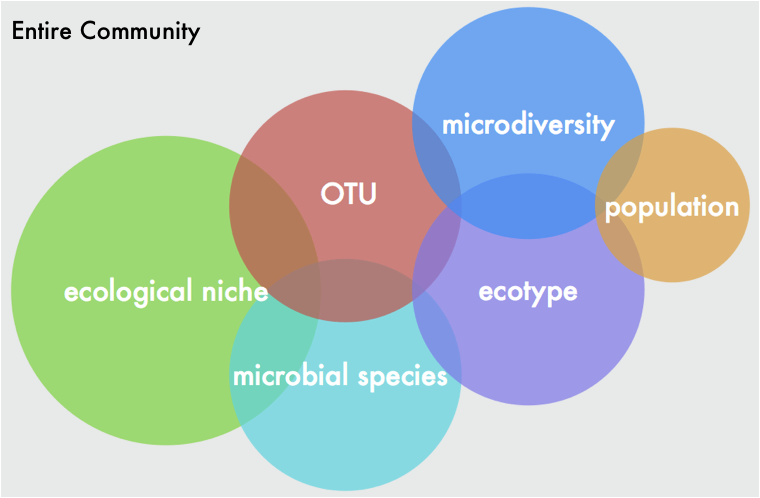
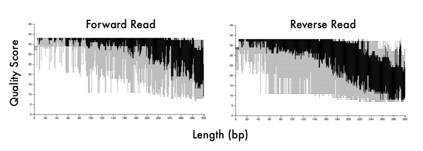

# 16S-workshop
Introduction to microbiome analysis workshop focused on 16S rRNA amplicon-based sequence data. A lot of the workflow is adapted from a nice workshop led by the [UCI Microbiome Initiative](http://microbiome.uci.edu/)

If you want some more informal thoughts from me on microbiome analyses, please check out my [website](https://www.abchase.co) and [blog post](http://www.abchase.co/blog/intro-to-microbiome-analyses) where I wrote about this workshop and break down a lot of these ideas more thoroughly.

  

# BEFORE you start
Please follow these directions to go through the workflow

The workshop will discuss broadly the tools used to analyze microbiome datasets. First, I will introduce which sequencing analyses are applicable to answer the biological questions, including an overview on shotgun metagenomics and amplicon-based sequencing (i.e., 16S rRNA). Next, I will guide a hands-on workshop about some basic R commands to introduce participants to the environment and its capabilities (~10-20 min). I am including this section so students/faculty with no experience can participate and follow along. Finally, we will work with some microbiome data after it has been processed with popular pipelines such as QIIME2 and DADA2. I will not go over these in detail as there are tons of online resources to pass your data through these user-friendly pipelines. I will focus more on data interpretation or what to do once you have taxa bar plots or OTU tables.

For the workshop, students/faculty should come with some things already installed on their laptops. 

The attached [materials](https://github.com/alex-b-chase/16S-workshop/tree/master/materials) folder contains data we will experiment with during the workshop.

Here are some instructions before you attend:
1. Install R for your operating system. You can follow instructions [here](https://cran.cnr.berkeley.edu/)
2. Install R Studio for your operating system. You can follow instructions [here](https://rstudio.com/products/rstudio/download/#download)
3. Follow prompts for each installation to install applications
4. If you already have R and R Studio installed, make sure you have a more current version of R working on your machine. You need at least R 3.5 or newer. You can update using the following commands; however, this will require you also updating a lot of your packages that you may have installed previously.

install.packages('devtools') #assuming it is not already installed
library(devtools)
install_github('andreacirilloac/updateR')
library(updateR)
updateR(admin_password = 'your user password')  

5. After installing everything, open R Studio. Navigate the toolbar to File > Open File and load the "Package_install.R" code attached below. 
6. Follow the instructions in the file and load some packages we will be exploring for the workshop. This should take about 15 min to run and require users to respond to prompts about loading package binaries. 

# Overview of microbiome data
[Presentation](sio262-microbiome-analysis.pdf) going over sequencing data and analyses, including alpha- and beta-diversity analyses. All done in R!!!

Obviously, this is an introduction to microbiome analyses, so please read up on a lot of the complexities that go into these types of analyses. Here are some (hopefully) helpful links. I will try and update as I find more.

[Rarefaction, Alpha Diversity, and Statistics](https://www.frontiersin.org/articles/10.3389/fmicb.2019.02407/full)

  

# Materials and sample data
Sample Data

R workflow
