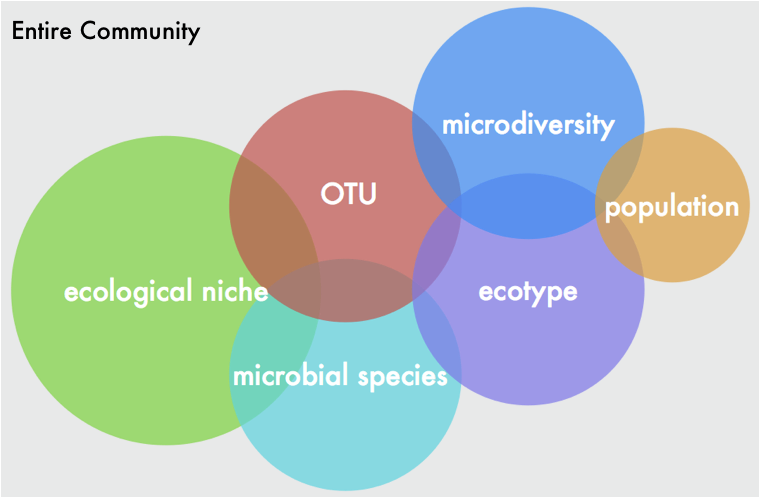
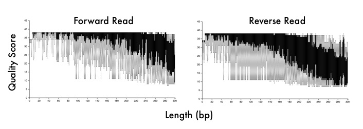

# Introduction to Microbiome Analyses Workshop

Introduction to microbiome analysis workshop focused on 16S rRNA amplicon-based sequence data. A lot of the original workflow was adapted from a nice workshop led by the [UCI Microbiome Initiative](https://microbiome.uci.edu/).

If you want some more informal thoughts from me on microbiome analyses, please check out my [website](https://www.microbomics.com/) and [blog post](https://www.microbomics.com/uploads/1/2/4/8/124844826/vol1iss1.pdf), where I wrote about this workshop and break down a lot of these ideas more thoroughly.

  

# BEFORE you start

Please follow these directions before starting the workflow.

The workshop will broadly discuss the tools used to analyze microbiome datasets. First, I will introduce different sequencing approaches and how they relate to the biological questions being asked, including an overview of shotgun metagenomics and amplicon-based sequencing (i.e., 16S rRNA gene sequencing). Next, I will guide a short hands-on introduction to basic R commands and the R environment (~10–20 min). I include this section so that students/faculty with little or no experience in R can participate and follow along.

Finally, we will work with microbiome data after the sequencing reads have already been processed using tools such as QIIME 2 and DADA2. I will not go through raw sequence processing in detail because there are excellent tutorials available for these tools. Instead, this workshop focuses on downstream analysis and, more importantly, data interpretation: **what do you do once you have an ASV table, taxonomic assignments, and sample metadata?**

For the workshop, students/faculty should come with a few things already installed on their laptops.

The [materials](materials/) folder contains data we will experiment with during the workshop.

Here are some instructions before you attend:

1. Install the current version of R for your operating system from [CRAN](https://cran.r-project.org/).
2. Install [RStudio Desktop](https://posit.co/download/rstudio-desktop/) for your operating system. **Install R before installing RStudio.**
3. Follow the installation prompts for both applications.
4. If you already have R and RStudio installed but have not updated them in several years, install a current version of R before the workshop.
5. After installing everything, open RStudio. Navigate to **File > Open File** and open `Package_install.R`.
6. Follow the instructions in the file to install the packages we will use during the workshop. Package installation may take several minutes depending on your computer and internet connection.

If you receive an error while installing packages, save the complete error message. We can troubleshoot installation problems during the workshop.

# Overview of microbiome data

The [presentation](sio262-microbiome-analysis.pdf) provides an overview of sequencing data and downstream analyses, including alpha- and beta-diversity analyses. All done in R!

Obviously, this is an introduction to microbiome analysis, so please read up on the many complexities and assumptions that go into these types of analyses. There is rarely a single "correct" analysis for every dataset. The appropriate approach depends on the biological question, experimental design, properties of the data, and assumptions of the statistical method.

Here are some useful starting points:

[Best practices for analysing microbiomes](https://doi.org/10.1038/s41579-018-0029-9)

[Microbiome datasets are compositional: and this is not optional](https://doi.org/10.3389/fmicb.2017.02224)

[Rarefaction, Alpha Diversity, and Statistics](https://doi.org/10.3389/fmicb.2019.02407)

[Microbiome differential abundance methods produce different results across 38 datasets](https://doi.org/10.1038/s41467-022-28034-z)

  

---

The general workflow will be:

1. **Demultiplex**

   * Separate reads from a sequencing run into individual samples.

2. **Quality control and denoising**

   * Remove primers/adapters and low-quality sequence data *(see above figure)*.
   * Identify and remove sequencing errors and chimeric sequences.
   * Tools such as DADA2 can perform several of these steps.

3. **Generate ASVs**

   * Modern amplicon workflows commonly infer **amplicon sequence variants (ASVs)** rather than clustering sequences into traditional operational taxonomic units (OTUs).
   * The resulting ASV table contains the read abundance of each sequence variant across all samples: basically a giant abundance matrix!

4. **Assign taxonomy**

   * Compare ASV sequences against a reference database to infer their taxonomic identities.
   * Remember that taxonomic resolution depends on the amplified region, reference database, classifier, and underlying sequence variation.

5. **Filter and inspect the ASV table**

   * Remove unwanted sequences when appropriate, such as chloroplasts, mitochondria, contaminants, or non-target taxa.
   * Examine sequencing depth and consider whether extremely low-depth samples or extremely rare ASVs should be removed.

6. **Account for sequencing depth and data structure**

   * Microbiome sequencing data are inherently compositional, and there is no single normalization approach appropriate for every analysis.
   * Rarefaction/subsampling is useful for some questions, particularly certain diversity comparisons, but should not simply be treated as a universal normalization step.
   * Transformations, normalization procedures, and filtering choices should depend on the analysis being performed.

7. **Diversity and community composition**

   * This is where you will want to understand some basic ecological and multivariate statistics. Different metrics emphasize different properties of a microbial community, so your choices should follow from your biological question.

### Alpha diversity

Alpha diversity describes diversity **within a sample or local community**.

* **Observed richness** — the number of ASVs observed in a sample. Strongly influenced by sampling/sequencing depth.
* **Shannon diversity** — incorporates both richness and evenness and is sensitive to changes across both relatively common and less abundant taxa.
* **Simpson diversity** — also incorporates richness and evenness but gives greater weight to relatively abundant taxa.

There are many other options, including metrics that incorporate phylogenetic relationships. **Choose a metric based on what aspect of diversity you actually want to measure.**

### Beta diversity

Beta diversity describes differences in community composition **among samples**.

This generally begins by calculating a distance or dissimilarity matrix, where samples are compared based on their community composition.

Common examples include:

* **Bray-Curtis dissimilarity** — incorporates differences in taxon abundance.
* **Jaccard distance** — based on presence/absence.
* **UniFrac** — incorporates phylogenetic relationships among taxa.

There are many more options, and different metrics can produce different views of the same microbial communities. **READ UP ON WHAT YOUR METRIC IS ACTUALLY MEASURING!**

Distance matrices can then be visualized using approaches such as PCoA or NMDS and statistically evaluated using approaches such as PERMANOVA.

Remember: **an ordination plot is a visualization, not a statistical test.**

# Materials and sample data

For my workshop, I do not go from raw sequencing data all the way through the entire processing workflow—there is simply no time to cover everything well.

The current [QIIME 2 amplicon documentation](https://amplicon-docs.qiime2.org/en/stable/) provides tutorials and conceptual explanations for marker-gene analysis, and the [DADA2 tutorial](https://benjjneb.github.io/dada2/tutorial.html) provides an excellent walkthrough of processing raw amplicon sequencing data into an ASV table.

Instead, I focus on the **downstream, post-ASV-table portion** of microbiome analysis.

I do include some sample [bash scripts](sample-qiime-processing/) illustrating how QIIME 2 can be run on a high-performance computing cluster (HPC). These are included as examples only. You will need to modify them for your computing environment, QIIME 2 version, sequencing files, and experimental design.

## R workflow

Congrats if you made it this far! This is where we can start to get our hands dirty and analyze some data.

I will be using the R software environment for this, so please brush up on some R basics beforehand. I provide a short introduction [here](R-scripts/intro-to-R-basics.R). R is an incredibly flexible environment for importing, manipulating, visualizing, and statistically analyzing biological data. Trust me, it is worth the investment to get your work off the ground.

Now for the microbiome analysis part.

You can use the sample data provided in [materials](materials/) to follow along. Everything should work, but definitely post an issue here if I missed something.

We will use a relatively simple mouse microbiome dataset for the workshop. The metadata contain information about:

1. **Experiment:** feeding effects on individual mouse microbiomes
2. **Biological/experimental variables:** Sample ID, cage, plot, time point, etc.
3. **Technical variables:** information associated with sample processing and experimental procedures

An important part of the exercise is thinking about which variables represent the biological questions we actually care about and which may represent technical sources of variation.

[Download the code](R-scripts/microbiome-workflow.R) and run it for yourself!

More importantly than simply getting the code to run, think about what each analysis is measuring, why you selected it, and what biological conclusion the result actually supports.
